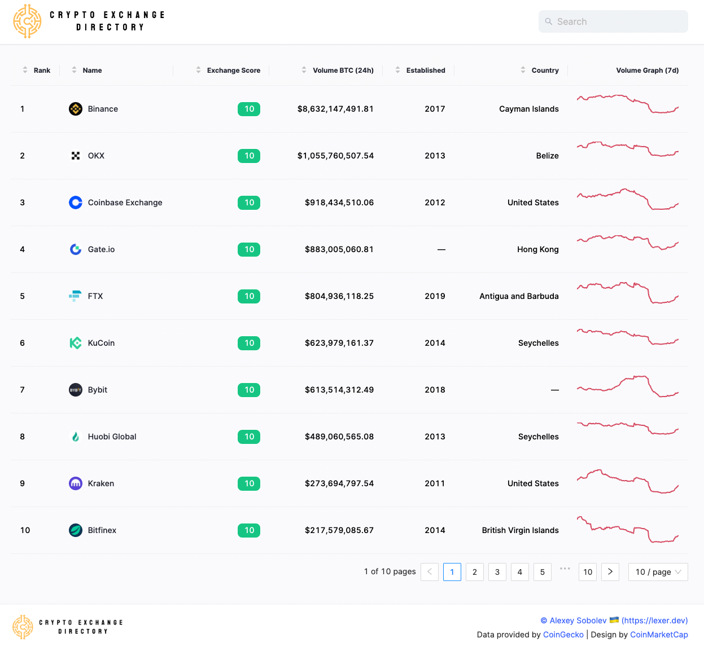
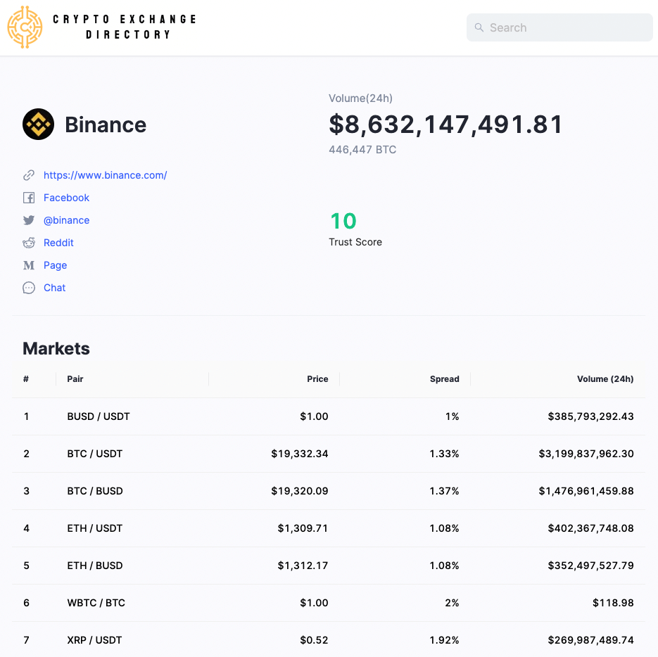
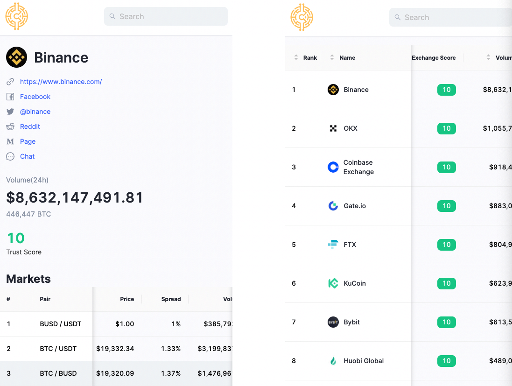

# Crypto Exchange Directory

The design of the page was inspired by [CoinMarketCap](https://coinmarketcap.com/rankings/exchanges/com/)  

   

The hosted project website is available under [exchange.lexer.dev](https://exchange.lexer.dev/)

   

   

### Screenshots

#### Home page

   

   

#### Details page

   

   

#### Mobile view

   

   

### Technologies

* [React](https://reactjs.org/)
* [TypeScript](https://www.typescriptlang.org/)
* [Vite React TS boilerplate](https://vitejs.dev/guide/)
* [SWR library for data fetching](https://swr.vercel.app/)
* [Ant Design System](https://ant.design/components/overview/)
* [Sass CSS preprocessor](https://sass-lang.com/)
* [Cypress e2e testing framework](https://www.cypress.io/)
* [Firebase hosting](https://exchange.lexer.dev/)

   

  

### Key Features

#### Real time exchange data provided by **CoinGecko**
Exchange data is fetched from [`CoinGecko's API`](https://www.coingecko.com/en/api). The result contains extended information about each exchange, including trust score, trading volume, exchange location and logo URL, current token prices.  
This data is fetched once per hour and cached using the SWR library.

#### Responsive design 
The application is build using fluid design and adapts to any screen resolution

#### Search
Fully functional search functionality provided by [JS-Search plugin](http://bvaughn.github.io/js-search/). It runs over cached items and the result is shown instantly.

#### Framework
This project was bootstrapped with [Vite React TS boilerplate](https://vitejs.dev/guide/).

#### Hosting
The project is hosted on Firebase and available under [exchange.lexer.dev](https://exchange.lexer.dev/)

   

  

### E2E Testing
* [Cypress](https://www.cypress.io/) Testing Framework is used to test end-to-end functionality on each page
* Test suite definitions are available under [./cypress/e2e](./cypress/e2e)
* All network requests are stubbed with fixtures available under [./cypress/fixtures](./cypress/fixtures)
* Cypress application can be started by executing `npm run cy:open` from another terminal. **Please make sure that client application is running in the main terminal**
* Select `E2E Testing` option once the application starts, then select Chrome browser  

* In the window which opens next select one of the available spec files, e.g. **landing.cy.js**  

* The respective test suite will execute automatically producing a visual feedback which can be followed along. Each test case can be replayed by navigating over them with the cursor.

* Cypress also works in a headless mode where it will run all test suites and generate screenshots/videos in case of any issues. It can be started with `npm test`  

### Performance
* API responses are cached and stored in browsers' storage
* Image assets are cached by the browser

### Bundle size
* The build is minified and the filenames include the hashes
* Bundle size without source maps is 1.4 MB, from which minified JS portion is 725 kB and minified CSS portion is 570 kB

### Setup & run

* Install packages by running `npm install` in the root folder
* Run application with `npm start`

#### **Available Scripts**

In the project directory, you can run:

#### `npm start`

Runs the app in the development mode.\
Open [http://localhost:3000](http://localhost:3000) to view it in the browser.

The page will reload if you make edits.\
You will also see any lint errors in the console.

#### `npm test`

Launches the Cypress test runner

#### `npm run cy:open`

Launches the interactive Cypress application with extended functionality.\
See the section about [running tests](#testing) for more information.

#### `npm run build`

Builds the app for production to the `dist` folder.\
It correctly bundles React in production mode and optimizes the build for the best performance.
The build is minified and the filenames include the hashes.\

   

   

### Disclaimer

The design of the page was taken from the [CoinMarketCap](https://coinmarketcap.com/rankings/). This project was created for demonstrational purposes only. I do **NOT** intend to produce any commercial content from this!

   
